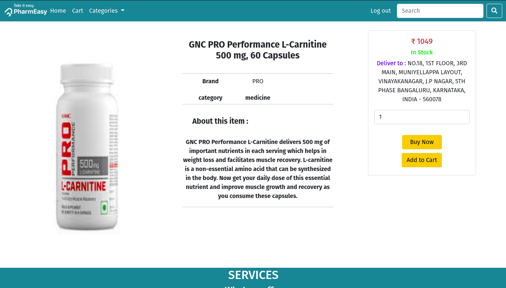

# PharmEasy.com
## This project was made for DBMS laboratory subject as a mini project by usining pure php language for 5th semester , which it represent an online pharmacy store.
## Main page:

## Functionality
* ### user log in :

* ### user sign up :

* ### search :

* ### product :

* ### cart :

* ### order conformation :

* ### admin home :

* ### admin log in :

* ### orders details and mangement :

* ### Products details :

* ### add new Product :

* ### edit Product :

* ### search for Product :

* ### customers details :

* ### edit customer :

* ### search for customer :

* ### admins details :

* ### add new admin account :

* ### edit admin :

* ### search for admin :

### the infront-end has done with help of @mdfaisalahmed057

<!-- <?php
include "includes/functions.php";
?>
<?php -->
// Include the TCPDF library
<!-- require_once('C:/xampp/htdocs/PharmEasy/lib/tcpdf/tcpdf.php'); -->

// function fetchInvoiceDataFromDB() {
//     $num = ''; // Initialize $num

//     // Check if 'id' is set in $_GET
  
//     // Implement your database connection and query to fetch invoice data
//     // For demonstration purposes, I'll just return sample data
//     $invoiceData = array(
//         'invoice_number' => $num,
//         'date' => date('Y-m-d'),
//         'items' => array(
//             array('name' => 'Item 1', 'quantity' => 1, 'price' => 10.00),
//             array('name' => 'Item 2', 'quantity' => 2, 'price' => 5.00)
//         )
//     );

//     return $invoiceData;
// }

// Fetch invoice data from the database
<!-- if (isset($_GET['id'])) {
    // Get the ID from the URL
    $id = $_GET['id'];

    // Fetch invoice data from the database based on the ID
    $invoiceData = fetchInvoiceDataFromDB($id);
      $data = var_dump($invoiceData);;
    // Create a new TCPDF instance
    $pdf = new TCPDF(PDF_PAGE_ORIENTATION, PDF_UNIT, PDF_PAGE_FORMAT, true, 'UTF-8', false);

    // Set document information
    $pdf->SetCreator('Your Company');
    $pdf->SetAuthor('Your Name');
    $pdf->SetTitle('Invoice');
    $pdf->SetSubject('Invoice');
    $pdf->SetKeywords('Invoice, PDF, Example');

    // Add a page
    $pdf->AddPage();

    // Build HTML for invoice
    $html = '
        <h1>Invoice</h1>
        
Invoice Number: ' . $data['order_id'] . '

        
Date: ' . $data['order_date'] . '

        <table border="1">
            <tr>
                <th>Item</th>
                <th>Quantity</th>
                <th>Price</th>
                <th>Total</th>
            </tr>';

    // Calculate total amount
    $totalAmount = 0;

    // Loop through items
    // foreach ($invoiceData['items'] as $item) {
    //     $total = $item['quantity'] * $item['price'];
    //     $totalAmount += $total;

    //     // Add item row to HTML
    //     $html .= '
    //         <tr>
    //             <td>' . $item['name'] . '</td>
    //             <td>' . $item['quantity'] . '</td>
    //             <td>$' . number_format($item['price'], 2) . '</td>
    //             <td>$' . number_format($total, 2) . '</td>
    //         </tr>';
    // }

    // Add total row to HTML
    $html .= '
            <tr>
                <td colspan="3" align="right"><strong>Total:</strong></td>
                <td>$' . number_format($totalAmount, 2) . '</td>
            </tr>
        </table>';

    // Write the HTML content to the PDF
    $pdf->writeHTML($html, true, false, true, false, '');

    // Close and output PDF
    // $pdf->Output('invoice.pdf', 'D');

    // Terminate script
    exit;
} else {
    echo "ID not provided.";
}
// Terminate script
exit;
?> -->
